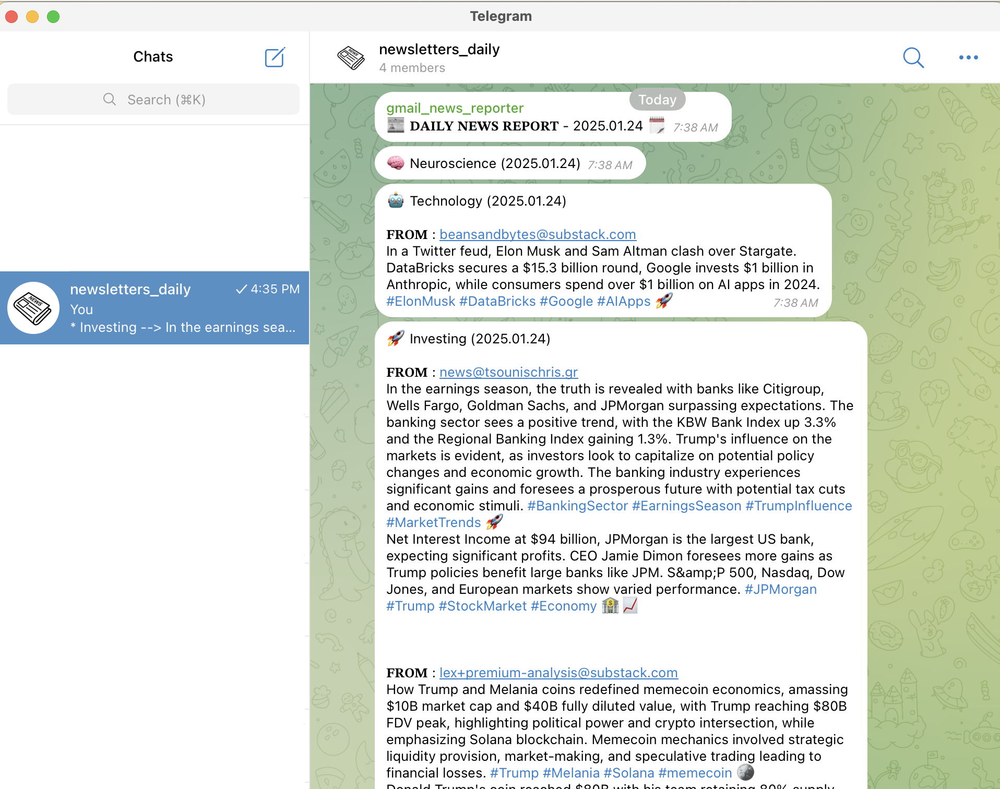

# Gmail Newsletter Reporter 📬📊

Gmail Reporter is a Python-based automation project that integrates Gmail, Google Sheets, Google Docs, and OpenAI APIs to streamline email summarization and report generation. It leverages advanced APIs and CLI configurations to provide a seamless experience for managing and analyzing email communications.

---

## 🚀 **Features**
### 📧 Email Retrieval and Analysis
- **Dynamic Email Fetching:**
  - Uses the class `GoogleEmailAPI` to conntect to Gmail and retrieve emails based on a configurable time window (e.g., last 24 hours).
  - Extract metadata and body content for processing.
  - Parses subject, sender, and email body for analysis.
- **Dynamic Config Fetching:**
  - Uses the `GoogleSheetdAPI` to conect to Google Sheets and fetch configuration data from Google Sheets, including target Google Drive folder IDs and reporting parameters and the newsletters metadata (newsletter name, category, email)
- **Content Summarization:**
  - Uses the `OpenaiAPI` to retrieve a predefined OpenAI's GPT model
  - Summarizes email content using the GPT model to generate concise summaries based on a predefined prompt
  - Generates token usage statistics for tracking API costs, including raw, cleaned, and summarized tokens.
- **Categorization:**
  - Automatically classifies emails into newsletters (based on the defined newsletters on the Control Center), ensuring only relevant emails are processed.

### 📝 Report Generation
- **Summary Reports:**
  - Generates detailed `.txt` summaries for each email and saves them locally
  - Uses the `GoogleSheetdAPI` to connect to Google Docs and appends the summarized content to the respective Google Doc titled `(Year Month) Newsletters Summaries`.
- **Google Sheets Integration:**
  - Saves configuration data (e.g., folder IDs, reporting parameters) and execution metrics (e.g., number of emails processed, token usage).
  - Uses the `GoogleSheetdAPI` to connect to Google Sheets once again and ynamically updates Control Center for tracking execution details (logs) such as emails filtered, token usage, and runtime information.

### 🤖 Telegram Notifications (Optional)
- Instant Updates:
   - Optionally integrates with `TelegramAPI` to send notifications or report summaries to a designated chat.
   - Configurable via CLI to enable or disable Telegram notifications during execution.


### 🕒 Configurable Scheduling
- **Custom Scheduling:**
  - Supports CLI arguments to set:
    - Time window for email retrieval (`--hours`, `--days_diff`).
    - Scheduled execution hour (`--schedule_hour`).
    - Telegram polling (`--enable_polling`).
- **Automation:**
  - Runs continuously in a loop, with the ability to break out after completion.
  - Can break out of the loop based on completion criteria, such as already completed executions.


### 🕒 Execution Logging and Monitoring
- **Logging:**
   - Logs detailed execution metrics, including emails processed, token usage, execution time, and any runtime errors.
   - Ensures real-time tracking and debugging, offering insights into system performance.


---

## 📦 **Usage**
*Join My Telegram Channel to Receive Newsletter Summaries, of follow the steps below [here](#⚙️-set-up) to set-up the code for yourself and summarize your own newsletters*


1. Join my Telegram channel [here](https://t.me/gmail_news_reporter_bot) to receive summaries of newsletters from my Google email subscriptions. You can find the summary data in the linked [Google Sheets](https://docs.google.com/spreadsheets/d/178qbmHT8iEItMLe1pPD2LLj4_Q8SGZ2bFABwVwO3710/edit?gid=933045049#gid=933045049).
2. Press `/help` to check all the available commands
3. Press `/register_chat_id` to register
4. Once you're registered, the summaries will be delivered automatically once per day ()


<div style="text-align: center;">
  
</div>

---

## ⚙️ **Set-up**
*Set Up the Script to Run on Your Own*

1. **Clone the Repository:** (~1 min)
   ```bash
   git clone https://github.com/jimmyg1997/gmail-newsletter-reporter
   cd gmail-newsletter-reporter
   ```

2. **Set Up Conda Virtual Environment:** (~3 min)
- First, Ensure that you have Conda installed on your system [here](https://docs.conda.io/projects/conda/en/latest/user-guide/install/) and create a new Conda virtual environment:
   ```bash
   conda create --name venv-newsletter-reporter python=3.11
   ```
- Activate the Conda virtual environment:
   ```bash
   conda activate venv-newsletter-reporter
   ```

3. **Install Dependencies:** (inside the virtual environment) (~3 min)
   ```bash
   pip install -r requirements.txt
   ```

4. **Set Up Google Files and Folders** (~15-20min)
   - Open my Control Center Google Sheets file [here](https://docs.google.com/spreadsheets/d/178qbmHT8iEItMLe1pPD2LLj4_Q8SGZ2bFABwVwO3710)
   - Go to File > Make a copy. Rename it if you want. This file will be your reporer. The source of truth. 
      - **Configure** | Tab named `config_newsletters` has all the necessary information for your newsletters. Currently is manually updated. What you see is my newsletters! If you want to get summaries of your newsletters from your email, jstu check your email and find to which newsletters you are registered and then configure the tab `config_newsletters` accordingly
      - *Nothing to do* | T Tab `config_telegram` has all the necessary information for all the chat ids that are registered to your application through telegram and which will receive the newsletters summaries everytime you execute the code (and in case you have enabled pooling for telegram API)
      - *Nothing to do* | Tab named `readMe` has all the necessary information for everything related to the tab names
      - *Nothing to do* | Tab named `config_docs` has all the necessary information for Google Drive Folder, and all the Google Docs report files were the newsletters summaries are produced. eg. If today is 2025.01.01, then the code makes sure to generate (based on a template) a new Google Docs (and also paste the respective id here) for this respective month (we have one Google Docs per month so that there is no chaos and not everything is hectic or we have large files) 
      - *Nothing to do* | Tab named `logs` has all the necessary information for the logs during the execution of the code. These table logs for each execution will also be appened to the respective Google Docs which is under the tab `config_docs`
      - *Nothing to do* | Tab named `logs_graphs` has all graphs related to `logs`
   - Go to the [Google Drive](https://drive.google.com/) and create a new folder and name it eg. `project`
   - Move the Control Center Google Sheets file you just created inside the folder `project`
   - Right click on the folder, share and change General Access from `Restricted` to `Anyone with the link`
   - Go the url and copy the ID eg. if the url is `https://drive.google.com/drive/folders/xxxx` then the id is `xxxx`
   - Go back to the Control Center at the tab `config_docs` and paste the id eg. `xxxx` on the cell `E3`. This is important so that the code knows the location of the drive folder to generate the reports
   - *Note* : make sure ot have enough space in Google Drive for all these operations


<div style="text-align: center;">
  
</div>


5. **Set Up Environment Variables:** (~10min)
- Copy the `config/config.ini.example` file and rename the copy to `config/config.ini` 
- Configure `Telegram API` (optional) `OpenAI API` and  `Google API` (to effectively use Google Sheets, Google Drive, Google Docs) and retrieve all token API keys and file paths. Check the details in the specified documentation [here](./config_apis.md)
- Open your Control Center Google sheets file, go to the url and copy the ID, eg. if the url is `https://docs.google.com/spreadsheets/d/yyyy` then the id is `yyyy`
- Collect all these token API keys and IDs and fill in the required values in the file  `config/config.ini` 
   ```bash
   [api_telegram]
      token_key = PUT-THE-KEY-YOU-RETRIEVED
   [api_openai]
      token_key = PUT-THE-KEY-YOU-RETRIEVED
   [api_google]
      token_file_path = ./config/secrets/oauth_google.json
   [google_sheets]
      reporter_id = yyyy
   ```

6. **Run the Script:** (Example) (~1 min)
- For more CLI options chec the CLI configruration options [here](#⚙️-cli-configuration-options)
- In the case that you wanna execute the code now, make sure that the argument `--schedule_hour` is set to your local time. Eg. if the time is `13:00` you need to set it up to `13`
   ```bash
   python3 main.py --hours 24 --schedule_hour 13 --enable_polling
   ```
- When everything is set and you want to schedule your automation to be up and running eg. through `Heroku` (or whicever other host you are using), make sure to update the `./run.sh` file as following
   ```bash
   #!/usr/bin/env python3
   # Go to the current folder of the script
   # Run the Python script
   python3 main.py --hours 24 --schedule_hour 13 --enable_polling
   ```

8. **Configure Heroku:** (~10 min)
If you want to automate the process, so that the code never stops running, then check the details in the specified documentation [here](./config_heroku.md). There is a subscription of $7/month for this small scale project

---
## 📅 **Subscriptions Required**

| Service                | Description                                                                                   | Cost Estimate       | Optional  |
|------------------------|-----------------------------------------------------------------------------------------------|---------------------|-----------|
| **OpenAI Subscription** | Required to use OpenAI's GPT models (e.g., `gpt-3.5-turbo-0125`) for summarization.           | ~$1/month           | No        |
| **Heroku Hosting**      | Optional hosting service to run the code continuously on the cloud. Only needed if you want the script to run automatically online. | ~$7/month for dynos | Yes       |


---
## ⚙️ **CLI Configuration Options**
| Argument              | Description                                                | Example           |
|-----------------------|------------------------------------------------------------|-------------------|
| `--hours`             | Sets the time window for email retrieval in hours.         | `--hours 24`      |
| `--days_diff`         | Sets the time window for email retrieval in days.          | `--days_diff 7`   |
| `--schedule_hour`     | Hour to schedule script execution (24-hour format).        | `--schedule_hour 9` |
| `--enable_polling`    | Enables Telegram polling for notifications.                | `--enable_polling` |


---
## 📊 **Execution Metrics** (logs)
You can find more information about the metrics used in my Control Center [here](https://docs.google.com/spreadsheets/d/178qbmHT8iEItMLe1pPD2LLj4_Q8SGZ2bFABwVwO3710) or in your Control Center Google Sheet (if you choose the option to set-up the project by yourself) file under the tab `logs`.

| Metric                             | Description                                      |
|------------------------------------|--------------------------------------------------|
| **Emails Processed**               | Number of emails analyzed during execution.      |
| **Emails Filtered**                | Number of emails that were newsletters of interest, with email body included.      |
| **Token Usage (Clean)**            | Total number of cleaned tokens consumed (email content after cleaning).             |
| **Token Usage (Clean Summarized)** | Total number of cleaned tokens consumed (email content after cleaning).             |
| **Execution Time**                 | Duration of script execution, in hours, based on start and end datetime.                   |
| **Average Tokens per Email (Raw)**                 | Average number of raw tokens used per filtered email $\frac{tokens_{raw}}{emails_{filtered}}$ |
| **Average Tokens per Email (Clean)**                 | Average number of cleaned tokens used per filtered email $\frac{tokens_{clean}}{emails_{filtered}}$  |
| **Average Tokens per Email (Clean Summarized)**                 | Average number of summarized clean tokens used per filtered email $\frac{tokens_{clean+summarized}}{emails_{filtered}}$  |


---
## 💡 **Future Enhancements**
 
- **Error Handling and Resilience:**
   - Implement retry logic for API calls.
   - Add graceful fallback for transient errors.
- **Modularization:**
   - Break large functions into smaller, reusable units.
   - Abstract repetitive tasks (e.g., logging, API connection handling).
- **Testing and CI/CD:**
   - Use `pytest` to create unit tests for individual components.
   - Integrate CI/CD pipelines for automated testing.
-**Scalability:**
   - Implement asynchronous processing for fetching and summarizing emails.
   - Batch large datasets for memory optimization.
   - Add support for additional email providers (e.g., Outlook, Yahoo).
- **Advanced Analytics:**
   - Add Natural Language Processing (NLP) features for sentiment analysis.
   - Generate visualizations (e.g., trends in email volume).
- **Dashboarding**
   - Implement a web dashboard for real-time tracking of reports.

---


## 🛡️ **License**
This project is licensed under the MIT License. See the `LICENSE` file for details.

---

## 🤝 **Contributing**
Contributions are welcome! Feel free to open an issue or submit a pull request to enhance the functionality.
