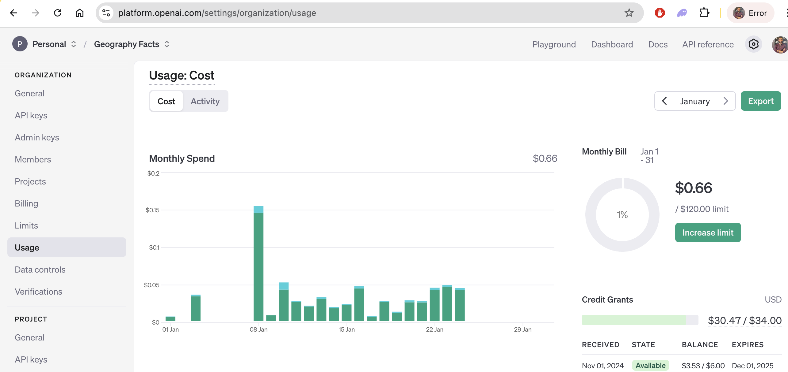

---
## ⚙️ **API Configuration Options**
### **Open API Configuration:**
To use this feature, follow these steps:
1. Create an OpenAI Account:
   - Sign up at [OpenAI](https://openai.com/) and log in to the dashboard.
2. Obtain an API Key:
   - Navigate to the "API Keys" section in your OpenAI account.
   - Generate a new API key and copy it.
3. **Subscription and Pricing:**
   - For some models (such as `gpt-3.5-turbo-0125` or more advanced models like `gpt-4`), a subscription is required to access the API.
   - Pricing for OpenAI models varies depending on the model and usage:
     - **`gpt-3.5-turbo`**: Generally included in the free tier (with limited usage), but can also be used under the paid plan. Pricing starts at around **$0.002 per 1,000 tokens**.
     - **`gpt-4`**: Requires a paid subscription. Pricing starts at **$0.03 per 1,000 tokens** for the 8K context model and **$0.06 per 1,000 tokens** for the 32K context model.
   - For the most up-to-date pricing and usage limits, refer to the [OpenAI Pricing Page](https://openai.com/pricing).
   - If you are using `gpt-3.5-turbo` or similar models, you may be able to use them for free under limited usage conditions, but higher usage or access to `gpt-4` models will require a paid subscription.

   - The default model used here is `gpt-3.5-turbo` and I pay around $1 per month, if you have subscription for another model please go at `./config/config.ini` and change accordingly the following :  
   ```bash
   [openai]
   model_name = gpt-3.5-turbo-0125
   ```





### **Google API Configuration:**
Requires Google API setup for `Gmail API`, `Google Drive API`, `Google Sheets API`, `Google Docs API`
1. Create a Project in Google Cloud Platform (GCP):
   - Go to the [Google Cloud Console](https://console.cloud.google.com)
   - Create a new project and note its name and project ID.
2. Enable Required APIs:
   - Navigate to the "API Library" in the GCP console.
   - Enable the APIs you need (e.g., Google Sheets, Google Drive, or Google Docs).

3. Authenticate the OAuth Consent Screen:
   - Go to the "OAuth consent screen" section in the GCP console.
   - Select "External" as the user type if you plan to make the app public.
   - Add required information like the application name, logo (optional), and authorized domains.
   - Add your email address as the developer contact and configure the scopes for the APIs you're using (e.g., Google Sheets, Google Drive, Google Docs, Gmail)

4. Publish the OAuth Consent Screen:
   - After completing the setup, publish the app to move it from "Testing" to "In Production."
   - This step ensures that the refresh token does not expire every 7 days. When in testing mode, tokens are subject to expiration; publishing makes them long-lasting

5. Set Up OAuth 2.0 Credentials:
   - Go to the "Credentials" tab in the GCP console.
   - Create OAuth 2.0 credentials. Choose "Deskop App" as type of application
   - Download the client_secret.json file.

6. Set Up Environment Variables:
   - Place the `client_secret.json` file in your project directory and store its path securely in the location `congig/secrets/client_secret.json`
   - Rename it to to `congig/secrets/ouaht_google.json`

### **Telegram API Configuration:** (optional)
To use this feature, follow these steps:
1. Create a Telegram Bot:
   - Open the Telegram app and search for "BotFather."
   - Start a chat with BotFather and send the command `/newbot` to create a new bot.
   - Follow the prompts to set the bot's name and username.
   - Copy the API token provided at the end of the process.
