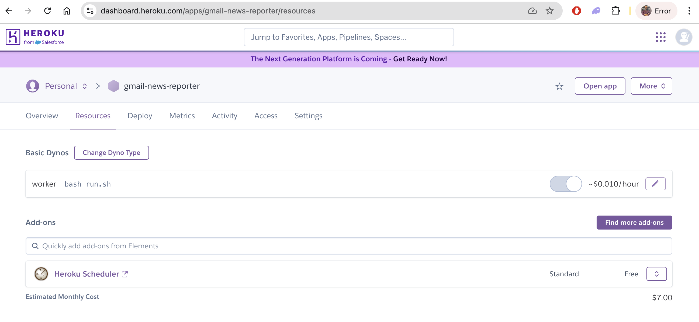

---
## ⚙️ **Heroku Configuration**
1. Create a Heroku App:
   - Go to Heroku and create a new profile
   - Create a new app, eg. `gmail-newsletters-reporter`

2. Install Heroku CLI:
   - Install the Heroku CLI and log in via the terminal:
   ```bash
      heroku login
   ```

3. Create Procfile: (if it does not exist)
   - In the project root, create a Procfile to specify the app’s entry point:

   ```bash
      worker: bash run.sh
   ```

4. Create .slugignore: (if it does not exist)
   - Prevent unnecessary files from being included in the Heroku slug (e.g., test, data folders, etc.):
   ```bash
      *.pyc
      *.pyo
      .git
      .gitignore
      run.sh
   ```

5. Push to Heroku:
   - Initialize Git and push the project to Heroku:
   ```bash
      git init
      heroku create
      git add .
      git commit -m "initial commit"
      git push heroku master
   ```

6. Heroku Pricing and Subscription:
   - Visit [Heroku Pricing Page](https://www.heroku.com/pricing) for more details. In this project we use the *Hobby Tier* and I pay around $7 per month (for the single dyno I have scheduled)
      - *Hobby Tier*: $7/dyno/month. Provides 24/7 availability without sleeping.
      - *Production Tier*: Starts at $25/dyno/month, designed for scaling and high-performance apps.

7. Run the App:
   - Go to [Heroku Dashboard](https://dashboard.heroku.com/apps/), and scale the worker process by clicking the "Resources" tab and turning on the worker dyno.



